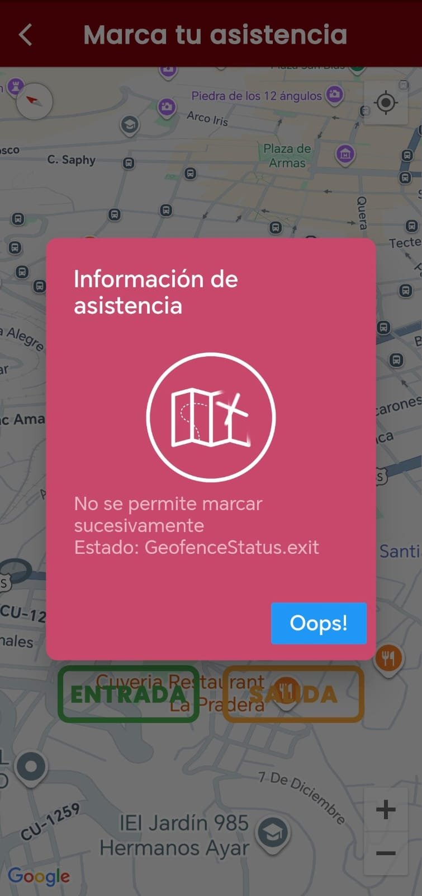
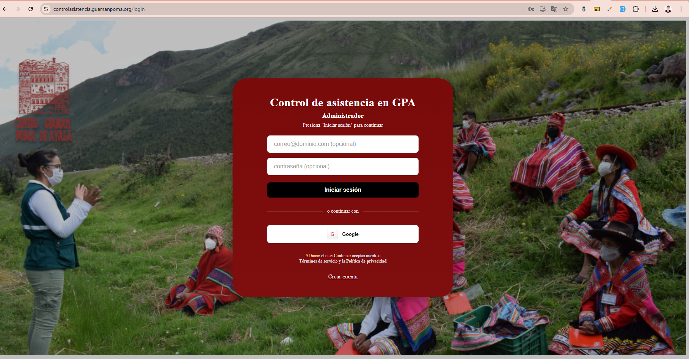
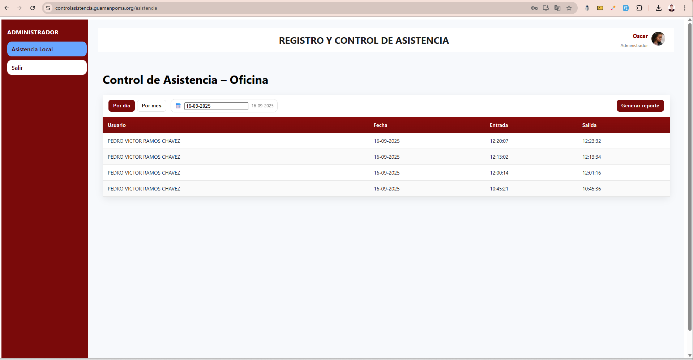

# Sistema de Asistencia con Geocercas (MVP ONG Guaman Poma de Ayala)

Aplicación para **registrar asistencia IN/OUT con validación GPS**, **consultar historial en tiempo real** y contar con un **panel básico para RRHH**.  
Resuelve la problemática de registros dispersos (biométricos, papel) y reduce la consolidación mensual de **~2 días a minutos**, mejorando transparencia y confiabilidad.

---

## Funcionalidades Incluidas

- **Registro de Asistencia con Geocerca**
  - Validación de ubicación con Google Maps + fórmula **Haversine**.
  - Algoritmo **FIFO**: evita dobles “IN” o registros inconsistentes.
  - Radio configurable por sede (ejm. 50 m / 100 m).

- **Autenticación Segura**
  - Firebase Auth (email/contraseña).
  - Cada colaborador posee un **employeeID** único vinculado a su UID.

- **Historial en Tiempo Real**
  - Consultas organizadas en tabla/calendario.
  - Filtros por **día, semana, mes**.

- **Panel RRHH**
  - Visualización de registros en tiempo real.
  - Exportación **CSV**.


---

## Tecnologías

- **Frontend móvil/web:** Flutter (Dart) / React JS
- **Backend & BD:** Firebase (Auth, Realtime Database)  
- **Geolocalización:** Google Maps SDK  
- **Arquitectura:** Clean Architecture  

---

## Configuración del Proyecto

### 1) Firebase
1. Crear un **Proyecto Firebase**.  
2. Agregar las apps:
   - **Android** → descargar `google-services.json` → `Asistencia-GPA/lib/src/`
3. Habilitar:
   - **Authentication** → Email/Password ON
   - **Realtime Database**
4. Configurar **Reglas RTDB** mínimas:

```json
{
  "rules": {
    ".read": true,
    ".write": true
  }
}

```

### 2) Estructura de la base (ejemplo JSON)
Importar con **Import JSON** en Firebase Realtime Database:

```json
{
  "location" : {
    "office1": {
      "latitude": -13.5182625,
      "longitude": -71.9682425,
      "name": "Guaman Poma de Ayala",
      "radius": 100
    },
        "office2" : {
          "latitude" : -13.5182625,
          "longitude" : -71.9682425,
          "name" : "Esquina Guaman Poma",
          "radius" : 100
        }
      },
  "EmployeeID" : {
    "36" : "raul@gmail.com",
    "245" : "abc@gmail.com",
    "hr" : {
      "123" : "cr@informatica.org",
      "241" : "rh@informatica.org"
    }
  }
}
```

---

## Google Maps API Key

Habilitar en [Google Cloud Console](https://console.developers.google.com):

- Maps SDK for Android

Configurar:

- **Android:** `android/app/src/main/AndroidManifest.xml`
```xml
<meta-data
  android:name="com.google.android.geo.API_KEY"
  android:value="API_KEY" />
```
## Instalación y Ejecución

### App Flutter
```bash
cd Asistencia-GPA
flutter clean
flutter pub get

# Android
flutter run --no-sound-null-safetys

```

### Panel RRHH (`admin-web/`)
```bash
cd admin-web
npm install
# Crear archivo .env.local con credenciales Firebase (VITE_FIREBASE_*)
npm run dev
```

---

## Pruebas Rápidas

1. Inicia sesión con usuario creado en Firebase Auth.  
2. Ubícar dentro de una **location** y marca **IN**.  
3. Salir de la geocerca → la app no permite marcar.  
4. Marca **OUT** para cerrar la jornada.  
5. Verifica historial personal y panel RRHH.  en https://controlasistencia.guamanpoma.org/

---

## Capturas
<ul>
  <li>Login</li>
  <li>Mapa (IN/OUT)</li>
  <li>Historial</li>
  <li>Panel RRHH</li>
</ul>

<p>
  
  
  
  
  
  
  
  
  
</p>

<p>
  
</p>
<p>
  
</p>

---

## Prototipos en Figma

Para visualizar el flujo de la aplicación antes del desarrollo, se diseñaron prototipos navegables en **Figma**:

- **App móvil (Flutter)**
  - [👉 Ver prototipo en Figma - Mobile](https://www.figma.com/proto/HXsydvoUubD5wUm2yFje6m/GeoAsistencia?node-id=56-1332&t=g9AypqRrXIJBtOKM-1&starting-point-node-id=1%3A2)  
  - Incluye:
    - Pantalla de **Login**
    - **Mapa con geocerca** y botones IN / OUT
    - **Historial** filtrable por fechas
    - Perfil de empleado

- **Panel RRHH (React Web)**
  - [👉 Ver prototipo en Figma - Desktop](https://www.figma.com/proto/1u3JX45sRygenOCViffGQd/Modelo-Control-de-asistencia?node-id=2-2398&starting-point-node-id=2%3A2772&t=u4aypwdZ8bgNuWh8-1)  
  - Incluye:
    - **Dashboard** con registros en tiempo real
    - **Exportación CSV**


## Equipo

- PEDRO VICTOR RAMOS CHAVEZ   244231@unsaac.edu.pe 
- CRISTIAN FERNANDO BECERRA YARIN    244212@unsaac.edu.pe
- EDWARD MACEDO VALERIANO     244222@unsaac.edu.pe
- BENJAMIN ESPEJO ALVAREZ     244218@unsaac.edu.pe

---


